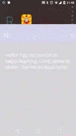

# TIL
Today I Learned some new things. My first Android app. Uses Reddit API. Available on [Google Play](https://play.google.com/store/apps/details?id=me.iahmed.til).  

##What is TIL?
TIL is a simple android application that displays user submissions on [/r/TodayILearned](http://reddit.com/r/TodayILearned).

##How it works?
TIL uses GET requests after obtaining an OAuth2 token from reddit.com. Responses are obtained 25 at a time and the display queue is updated
as the user exhausts locally stored responses.  
In addition, the app stores unique device IDs and user preferences for a consistent experience across sessions. 
  

  
##TODO [v0.6 updates]
* Add more subreddits to parse.
* Include internal webview for smoother experience. [DISCARDED]
* Incorporate sharing features. [DONE]
